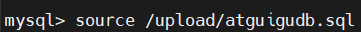

### sql规范

通常将关键字大写，而将表名，列名等小写
形如

```sql
SELECT * FROM table
```

使用`#`或`-- `作为单行注释
使用`/**/`作为多行注释(不能嵌套)

### 导入sql

在命令行中导入sql文件，使用`source`命令

```sql
source 系统中的绝对路径
```

形如


导入的sql
[sql](../source/atguigudb.sql)

