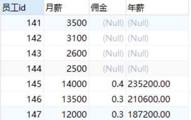
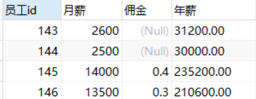

### 基本查询

#### 1. select基本用法

```sql
SELECT 字段名 FROM 表名；
```

字段名用逗号分隔，如果用*则代表查询所有字段


```sql
SELECT * FROM employees;

SELECT employee_id,first_name,last_name from employees;
```

#### 2. 字段别名

1. 在字段名后加空格然后写别名
  
```sql
SELECT employee_id id FROM employees;
```

2. 在字段名后加`AS`(alias)然后写上字段别名

```sql
SELECT employee_id AS id FROM employees;
```

3. 在字段名后用""将字段别名引起来（适用于字段别名包含空格的场景）

```sql
SELECT employee_id "employ id" FROM employees;
```

#### 3.去除重复行

使用`DISTINCT`关键字来进行去重
通常我们只会针对一个字段数据进行去重查询
例如，我们想知道所有的部门id

```sql
SELECT DISTINCT department_id FROM employees;
```

但是如果我们这样写

```sql
SELECT salary,DISTINCT department_id FROM employees;
```

就会报错，因为salary没有去重，而部门id去重，所以它们的行数无法对应，所以报错
如果想不报错，可以这么写

```sql
SELECT DISTINCT department_id,salary FROM employees;
```

这样写，`DISTINCT`作用于两个字段上，得到的结果可以看作salary和deaparment_id整体的不重复集合
没有实际意义，不建议用

### 4. null

1. null 不等同于 0或''
2. null参与运算会将结果也变为null
3. 使用`IFNULL()`函数来对null进行改变
例如，我们要求公司中每个员工的年薪

```sql
年薪 = 月薪*(1 + 佣金)*12
```

我们可以使用以下查询

```sql
SELECT employee_id 员工id,salary 月薪, commission_pct 佣金, salary*(1 + commission_pct)*12 年薪 
FROM employees;
```

查看结果

发现佣金为null的计算出的年薪也为null
我们使用`IFNULL`来解决这个问题,将null用0替换

```sql
SELECT employee_id 员工id,salary 月薪, commission_pct 佣金, salary*(1 + IFNULL(commission_pct,0))*12 年薪 FROM employees;
```

查看结果

可以看到佣金为0的年薪也计算出来了
`IFNULL`可以看作其他语言的三元运算符，例如

```javascript
IFNULL(commission_pct,0)
等价于
commission_pct == null ? 0 : commission_pct
```

如果commission_pct不为空，则使用它本身，否则用指定的值替换

### 5. 着重号

如果表名与sql中的关键字重复，我们可以使用``将表名引起来进行查询

```sql
SELECT * FROM order; #报错，order是关键字
SELECT * FROM `order`; # 通过
```

### 6. 查询常数

可以在查询结果的每一行中加入相同的值

```sql
SELECT '尚硅谷',employee_id FROM employees;
```

为每一行匹配尚硅谷字段

### 7. 显示表结构

使用`DESCRIBE` 或 `DESC` 即可获得一张表的结构
每个字段的类型，约束等

```sql
DESCRIBE employees;
DESC employees;
```
