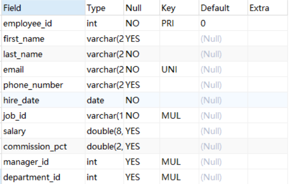
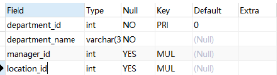
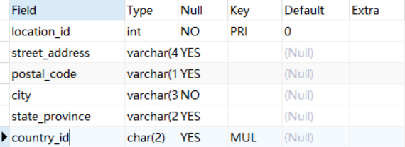

### 多表查询

查询多个表中的字段信息，在`FROM`后写上要查询的多个表，表与表间以逗号分隔
在`WHERE`语句中写入表的连接条件，如果要连接n个表，需要有n-1条连接条件

#### 1. 笛卡尔积

如果在多表查询时没有写连接条件，则得到的查询数据行数为每张表的行数相乘，即每张表的每一行都与其他表的每一行连接
这就时笛卡尔积

员工表，部门表，位置表结构如下







如果我们要查询员工id以及部门名称

```sql
SELECT employee_id,department_name
FROM employees,departments
# 连接条件(当两张表中department_id字段的值相同时才连接)
WHERE employees.department_id = departments.department_id;
```

如果再添加一个查询字段department_id呢
这样写？

```sql
SELECT employee_id,department_name,department_id
FROM employees,departments
# 连接条件(当两张表中department_id字段的值相同时才连接)
WHERE employees.department_id = departments.department_id;
```

上面的代码会报错，因为此时连接的两张表中都有这个字段，不清楚应该用哪张表的,所以我们需要加上表名

```sql
SELECT employee_id,department_name,employees.department_id
FROM employees,departments
# 连接条件(当两张表中department_id字段的值相同时才连接)
WHERE employees.department_id = departments.department_id;
```

>*注意:当我们查询连接的表中的共同字段时，必须指定其所属表名*

当然从优化角度看，只要是多表联查，我们每个字段都应该添加其表名
所以上面的代码，我们最好这么写

```sql
SELECT employees.employee_id,departments.department_name,employees.department_id
FROM employees,departments
WHERE employees.department_id = departments.department_id;
```

#### 2. 表的别名

我们可以在多表联查时在给表起别名，与字段别名类似

```sql
SELECT e.employee_id,d.department_name,e.department_id
# 给employees起别名为e,给departments起别名为d
FROM employees e,departments d
WHERE e.department_id = d.department_id;
```

>*注意:如果给表起了别名，那么在`WHERE`中或`SELECT`中使用表名时必须要用别名*

下面代码会报错，因为我们在`SELECT`中使用了表原名

```sql
SELECT employees.employee_id,d.department_name,e.department_id
# 给employees起别名为e,给departments起别名为d
FROM employees e,departments d
WHERE e.department_id = d.department_id;
```

查询员工id，姓名，部门名称，以及部门所在城市这些字段

```sql
SELECT e.employee_id,e.last_name,d.department_name,l.city
FROM employees e,departments d,locations l 
WHERE e.department_id = d.department_id
AND d.location_id = l.location_id;
```

#### 非等值连接

连接条件不是一一对应的，例如
查询员工的姓名，工资及其工资等级

```sql
SELECT last_name,salary,grade_level
FROM employees,job_grades
WHERE salary BETWEEN lowest_sal AND highest_sal; # 非等值
```

#### 自连接

有时候，表中的某个字段会引用自己本身某条记录的字段
我们查询时可以按照引用的字段,将表与其自身连接起来
例如，查询员工id，员工姓名，及其管理者的id和姓名

```sql
SELECT e.employee_id,e.last_name,m.employee_id,m.last_name
FROM employees e,employees m 
WHERE e.manager_id = m.employee_id; # employees表中，manager_id引用着自身的employee_id字段
```

#### 内连接与外连接

上述我们进行多表查询时都是将连接的表中有对应字段的行才连接，被称作内连接
而将不对应的行也查出来称作外连接
外连接分为

1. 左外连接，即将左表中没有满足连接条件的行也查询出来
2. 右外连接，即将右表中没有满足连接条件的行也查询出来
3. 全（满）外连接，将左右表中没有满足条件的行都查询出来

#### sql2内外连接

sql2即sql92，它的写法更简单
内连接就是前面所写的，使用`FROM`与`WHERE`即可
外连接使用`+`来连接
如果我们要查询所有员工的用户id即其对应的部门名称，用sql92可以这么写

```sql
SELECT employee_id,department_name
FROM employees,departments
WHERE employees.department_id = departments.department_id(+);
```

如上，即为左外连接，可以这么理解，因为我们要查询出employees表中所有数据，而departments表中我们只需要
满足连接条件的数据，查询出的结果肯定是左>右，为了让两张表高度相等，往右表中添加一个`+`

> *注意，以上写法在mysql中会报错，因为mysql并不支持`+`来实现外连接*

#### sql3内外连接

sql3即sql99，写法较sql2更复杂，但可读性更高

##### 内连接

sql99使用`表名 JOIN 表名 ON 连接条件`来连接两张表，如果要连接多张表，只用在后面继续添加`JOIN...ON...`即可
依然使用前面的例子
查询员工id，姓名，部门名称，以及部门所在城市这些字段

```sql
SELECT e.employee_id,e.last_name,d.department_name,l.city
FROM employees e JOIN departments d
ON e.department_id = d.department_id
JOIN locations l  # 继续连接表
ON d.location_id = l.location_id; 
```

其实上面的代码我们省略了一个关键字，即内连接关键`INNER`,它通常可以被省略，如果要加上它，代码是这样的

```sql
SELECT e.employee_id,e.last_name,d.department_name,l.city
FROM employees e INNER JOIN departments d
ON e.department_id = d.department_id
INNER JOIN locations l  # 继续连接表
ON d.location_id = l.location_id;
```

`INNER`代表内连接的话，自然而然的，我们就想到了两一个单词`OUTER`,不错它就是外连接关键字，我们使用上面的例子
查询所有员工的用户id即其对应的部门名称

> *注意：有所有这两个字时，大概率要求外连接*

```sql
SELECT employee_id,department_name
FROM employees LEFT JOIN departments
ON employees.department_id = departments.department_id;
```

🤔，上面的代码怎么没有`OUTER`,没错，和它兄弟`INNER`一样，它也可以被省略，如果不省略它，我们可以这么写

```sql
SELECT employee_id,department_name
FROM employees LEFT OUTER JOIN departments
ON employees.department_id = departments.department_id;
```

左外连接 -> `LEFT OUTER`，右外连接 -> `RIGHT OUTER`
那么全外连接呢?
在sql3中应该是`FULL OUTER`,但很可惜的是，mysql依然不支持👻👻，我们需要其他语句的帮助来让我们完成满外连接

#### UNION

`UNION`关键字，可以将两个`SELECT`的结果集合并为一个，重复区域只保留一次
`UNION ALL`两张表中重复的区域会有全部保留

> *注意：使用`UNION`时，两个结果集列数，数据结构必须相等，并且相互对应
> 开发中使用`UNION ALL`，占用的资源较小，因为不用去重*

7种连接操作


实现(以employees和deparmets表为例)

中图，内连接

```sql
SELECT employee_id,department_name
FROM employees JOIN departments
ON employees.department_id = departments.department_id;
```

左上图，左外连接

```sql 
SELECT employee_id,department_name
FROM employees LEFT JOIN departments
ON employees.department_id = departments.department_id;
```

右上图，右外连接

```sql 
SELECT employee_id,department_name
FROM employees RIGHT JOIN departments
ON employees.department_id = departments.department_id;
```

左中图

```sql 
SELECT employee_id,department_name
FROM employees LEFT JOIN departments
ON employees.department_id = departments.department_id
WHERE departments.department_id is NULL;
```

右中图

```sql 
SELECT employee_id,department_name
FROM employees RIGHT JOIN departments
ON employees.department_id = departments.department_id
WHERE employees.department_id is NULL;
```

左下图，全外连接

1. 左上 `UNION ALL` 右中
2. 右上 `UNION ALL` 左中

```sql
# 左上
SELECT employee_id,department_name
FROM employees RIGHT JOIN departments
ON employees.department_id = departments.department_id
UNION ALL
# 右中
SELECT employee_id,department_name
FROM employees LEFT JOIN departments
ON employees.department_id = departments.department_id
WHERE employees.department_id is NULL;
```

右下
左中 `UNION ALL` 右中

```sql
SELECT employee_id,department_name
FROM employees LEFT JOIN departments
ON employees.department_id = departments.department_id
WHERE departments.department_id is NULL
UNION ALL
SELECT employee_id,department_name
FROM employees RIGHT JOIN departments
ON employees.department_id = departments.department_id
WHERE employees.department_id is NULL;
```


